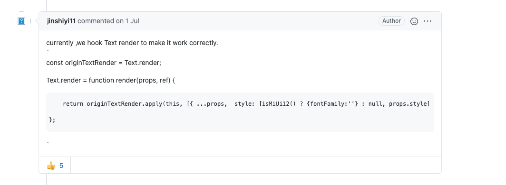
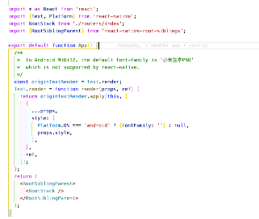

# RN填坑记录

### Q: 安装Homebrew，官网链接被墙了
A: 参考链接：https://www.cnblogs.com/xibushijie/p/13335988.html

### Q：使用Homebrew下载时卡在Updating Homebrew
A：解决方案： https://learnku.com/articles/18908

### Q：拉取新代码并合并冲突后，npm install 和 pod install 都没啥问题，运行就提示下载的模块找不到
A：可能是合并代码时某些环境与本地环境的不匹配导致的，把本地的Podfile.lock yarn.lock package-lock.json 都删掉重新生成了，运行正常

### Q：拉取新代码并合并冲突后，npm install 和 pod install 都没啥问题，手机可以运行，但模拟器调起报错，运行提示：
Error: Command failed: open /Applications/Xcode.app/Contents/Developer/Applications/Simulator.app --args -CurrentDeviceUDID 4AAA5021-3B89-4530-B5BC-720DBCEE1CE5
LSOpenURLsWithRole() failed with error -600 for the file /Applications/Xcode.app/Contents/Developer/Applications/Simulator.app.
其中注意到有个“ -CurrentDeviceUDID 4AAA5021-3B89-4530-B5BC-720DBCEE1CE5 ” 看起来很像是设备码，
A: 原因是当前的模拟器未关闭但也无法调起，简单粗暴的解决，直接杀掉当前模拟器重新开启就行了

### Q：react-native start 提示8081端口被占
A：方法一 https://www.jianshu.com/p/992422aefb9e
   方法二 https://blog.csdn.net/qq_35848894/article/details/84334920

### Q：集成react-native-image-picker后，Xcode build报错，ld: library not found for -lreact-native-image-picker
A：设置Xcode → TARGETS：StarPineapple → Build Settings → Library Search Paths → 添加上该库的路径。然后再build，若再报错 则把该添加的路径挪到列表顶部，build成功！

### Q: 在部分MIUI12的Android中，Text组件中的内容展示不全
A: 原因：This is caused by the default FontFamily of MIUI 12: "小米兰亭 PRO". It's a variable opentype Font, look like react-native doesn't support it. 
    RN的作者给出的方案是，改写Text组件的fontFamily。 参考链接： https://github.com/facebook/react-native/issues/29259
    

但是考虑到改写组件的风险，我只对有问题的地方设置了字体，Platform.OS === 'android' ? { fontFamily: '' }:null     这样要改的地方太多
解决：在根组件App.js中重写Text.render方法，修改Text的默认样式。


Q：RN组件 TextInput 在Android中文字没有垂直居中，在IOS中正常
A：TextInput有默认padding, 手动设置padding:0 即可

### TIPS：在Chrome中调试RN应用时候，碰到需要拦截&查看网络请求时：

在项目文件node_modules找到 react-native/Libraries/Core/InitializeCore.js
找到之后在文件末尾添加以下代码：

```js
global.XMLHttpRequest = global.originalXMLHttpRequest
      ? global.originalXMLHttpRequest
      : global.XMLHttpRequest
    global.FormData = global.originalFormData
      ? global.originalFormData
      : global.FormData
     
    fetch // Ensure to get the lazy property
     
    if (window.__FETCH_SUPPORT__) {
      // it's RNDebugger only to have
      window.__FETCH_SUPPORT__.blob = false
    } else {
      /*
       * Set __FETCH_SUPPORT__ to false is just work for `fetch`.
       * If you're using another way you can just use the native Blob and remove the `else` statement
       */
      global.Blob = global.originalBlob ? global.originalBlob : global.Blob
      global.FileReader = global.originalFileReader
        ? global.originalFileReader
        : global.FileReader
    }
```
返回chrome中查看Network即可查看请求&内容

### Q:如何保留node_module中对RN库源码的修改？
问题背景：有时候开发需要针对RN相关库作出自定义修改，或者BugFix，但yarn/npm install 后整个node_module库会被重置到其官方该版本release状态。对源码的自定义修改会被重置。

A：针对这种问题，目前有几种可选处理方案

方案一：使用私有repo

git clone react-native 源码，添加改动，提交至私有gitlab后作为替换安装。思路同Android及IOS的私有库使用流程，此处不做展开。

方案二：使用node patch

步骤1-安装patch-package
```sh
yarn install patch-package
```

步骤2-配置package.json
```json
"scripts": {
  ...
  "postinstall": "patch-package",
  ...
},
```

步骤3-创建patch补丁
```sh
yarn patch-package react-native --use-yarn
// 如果知道 更改了哪几个文件，可以针对性的处理，就不会有别的不相干信息也加入补丁了, 比如react-native/.DS_Store, node_modules/react-native/scripts/.packager.env 等
// eg 已知项目里改了 RCTImageLoader.mm 和 react.gradle，处理入下
yarn patch-package react-native --use-yarn --include 'RCTImageLoader.mm|react.gradle'
```

运行成功后，会生成./patches/*及对应的package的补丁patch

这样，在下次yarn install后，会直接通过patch的方式，对install进行hook，将补丁打入到对应的库中，达到了保存自定义改动的目的。
